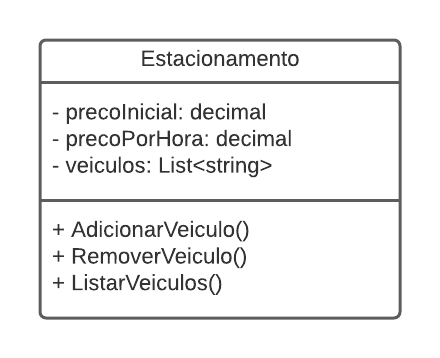

# DIO - Trilha .NET - Fundamentos
www.dio.me

## Desafio de projeto
Para este desafio, você precisará usar seus conhecimentos adquiridos no módulo de fundamentos, da trilha .NET da DIO.

## Contexto
Você foi contratado para construir um sistema para um estacionamento, que será usado para gerenciar os veículos estacionados e realizar suas operações, como por exemplo adicionar um veículo, remover um veículo (e exibir o valor cobrado durante o período) e listar os veículos.

## Proposta
Você precisará construir uma classe chamada "Estacionamento", conforme o diagrama abaixo:

A classe contém três variáveis, sendo:

**precoInicial**: Tipo decimal. É o preço cobrado para deixar seu veículo estacionado.

**precoPorHora**: Tipo decimal. É o preço por hora que o veículo permanecer estacionado.

**veiculos**: É uma lista de string, representando uma coleção de veículos estacionados. Contém apenas a placa do veículo.

A classe contém três métodos, sendo:

**AdicionarVeiculo**: Método responsável por receber uma placa digitada pelo usuário e guardar na variável **veiculos**.

**RemoverVeiculo**: Método responsável por verificar se um determinado veículo está estacionado, e caso positivo, irá pedir a quantidade de horas que ele permaneceu no estacionamento. Após isso, realiza o seguinte cálculo: **precoInicial** * **precoPorHora**, exibindo para o usuário.

**ListarVeiculos**: Lista todos os veículos presentes atualmente no estacionamento. Caso não haja nenhum, exibir a mensagem "Não há veículos estacionados".

Por último, deverá ser feito um menu interativo com as seguintes ações implementadas:
1. Cadastrar veículo
2. Remover veículo
3. Listar veículos
4. Encerrar

## Solução
Este código representa uma classe chamada `Estacionamento` no namespace `DesafioFundamentos.Models`. A classe é responsável por gerenciar um estacionamento, mantendo informações sobre o preço inicial, preço por hora, e os veículos estacionados. Aqui está uma descrição concisa de cada parte do código:

1. **Campos Privados:**
   - `precoInicial`: Armazena o preço inicial de estacionamento.
   - `precoPorHora`: Armazena o preço por hora de estacionamento.
   - `veiculos`: Um dicionário que mapeia placas de veículos a nomes dos condutores.

2. **Construtor:**
   - `public Estacionamento(decimal precoInicial, decimal precoPorHora)`: Inicializa a instância da classe com os preços iniciais fornecidos.

3. **Métodos Públicos:**
   - `public void AdicionarVeiculo()`: Solicita ao usuário a placa e o nome do condutor para adicionar um veículo ao estacionamento.
   - `public void RemoverVeiculo()`: Solicita ao usuário a placa do veículo a ser removido, verifica se o veículo está estacionado, calcula o preço com base nas horas de permanência e o remove da lista de veículos.
   - `public void ListarVeiculos()`: Lista os veículos estacionados, exibindo suas placas e os nomes dos condutores.

4. **Método Privado:**
   - `private decimal CalcularPreco(int horasPermanencia)`: Calcula o preço total com base no tempo de permanência e os preços configurados.

O código faz uso de estruturas de controle de fluxo, como loops e condicionais, e interage com o usuário por meio da classe `Console`. Além disso, utiliza coleções como o dicionário (`Dictionary`) para armazenar informações sobre os veículos estacionados.