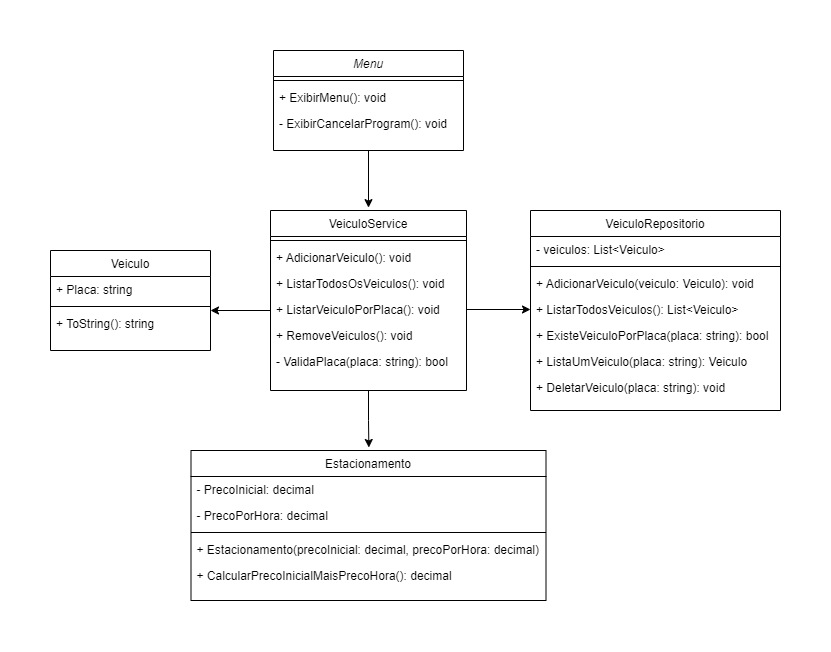

<h1 align="center">
  
  </br>
</h1>

[SITE DA DIO](https://web.dio.me/)

## Contexto
Você foi contratado para construir um sistema para um estacionamento, que será usado para gerenciar os veículos estacionados e realizar suas operações, como por exemplo adicionar um veículo, remover um veículo (e exibir o valor cobrado durante o período) listar um veículo e listar todos os veículos.

## Diagrama de Classe
<h1 align="center"> 
  
  </br>
</h1>

## Classe Veiculo:
- A classe **Veiculo** tem um atributo privado chamado **Placa** do tipo **string**.
- O método **ToString** é sobrescrito para fornecer uma representação textual do objeto, retornando a placa do veículo.

## Classe Estacionamenoto:
- A classe **Estacionamento** tem dois atributos privados: **PrecoInicial** e **PrecoPorHora**, ambos do tipo decimal.
- O construtor **Estacionamento** recebe dois parâmetros (precoInicial e precoPorHora) para inicializar os atributos da classe.
- O método **CalculaPrecoInicialMaisPrecoPorHora** retorna a soma dos valores de **PrecoInicial** e **PrecoPorHora**.

## Classe VeiculoService:
- A classe **VeiculoService** tem métodos públicos que interagem com a camada de dados (**VeiculoRepositorio**) e lida com a lógica de negócios relacionada aos veículos.
- **AdicionarVeiculo**: Solicita ao usuário uma placa, valida a placa, verifica se o veículo já está estacionado, cria um novo objeto Veiculo, o adiciona ao repositório e exibe mensagens apropriadas.
- **ListarTodosOsVeiculos**: Consulta todos os veículos no repositório e exibe suas informações ou informa se não há veículos estacionados.
- **ListarVeiculoPorPlaca**: é responsável por permitir a busca de um veículo específico no sistema de estacionamento com base na placa informada pelo usuário.
- **RemoverVeiculo**: Solicita ao usuário a placa do veículo a ser removido, cria uma instância de **Estacionamento**, consulta o veículo no repositório, calcula o valor total com base nas horas, remove o veículo do repositório e exibe mensagens apropriadas.
- **ValidarPlaca**: Valida a placa do veículo com base em critérios específicos.

## Classe VeiculoRepositorio:
- A classe **VeiculoRepositorio** contém um atributo privado chamado veiculos, que é uma lista de objetos da classe **Veiculo** e que já inicializa com três veículos estacionado.
- **AdicionarVeiculo**: Método público que adiciona um veículo à lista.
- **ListarTodosVeiculos**: Método público para consultar todos os veículos na lista.
- **ExisteVeiculoPorPlaca**: Método público que verifica se um veículo com a placa especificada existe na lista.
- **ListarUmVeiculo**: Método público que consulta um veículo específico com base na placa.
- **DeletarVeiculo**:  Método público que exclui um veículo com base na placa.

## Deverá ser feito um menu interativo primário com as seguintes ações implementadas:
1. **Adicionar um Novo Veículo**
2. **Listar Todos os Veículos**
3. **Localizar Veículo por Placa**
4. **Remover um Veículo Existente**
5. **Encerrar o Programa**

## Testes de Segurança de Software

Os testes de segurança de software desempenham um papel crucial no desenvolvimento de software, visando identificar e corrigir vulnerabilidades que poderiam ser exploradas por atacantes. Foram empregados ataques simulados em pontos vulneráveis da aplicação, resultando na implementação de correções efetivas.

- **Validação de Placas:** A classe **VeiculoService** possui um método **ValidarPlaca** que implementa verificações na entrada do usuário para validar a placa do veículo. Esse método utiliza expressões regulares para garantir que a placa siga um padrão específico.
- **Tratamento de Exceções:** Há alguns blocos de código que tratam exceções, por exemplo, na entrada do número de horas estacionado e no tratamento de formatos inválidos. Isso ajuda a evitar que o programa quebre inesperadamente e fornece uma melhor experiência para o usuário.
- **Interface do Usuário Melhorada:** A aplicação utiliza uma interface de console simples, e a validação de entrada de usuário é feita de forma básica. Em caso de uma aplicação maior, seria necessário uma interface mais robusta.
- **Manipulação Segura de Dados:** A manipulação de dados é realizada internamente, principalmente no repositório de veículos (VeiculoRepositorio). Dessa forma, garante que o tratamento dos dados seja feito na camada de serviços e armazenados na camada de dados.

## Ferramentas Usadas

- [C#](https://learn.microsoft.com/pt-br/dotnet/csharp/tour-of-csharp/)
- [.NET](https://dotnet.microsoft.com/pt-br/learn/dotnet/what-is-dotnet)
- [Visual Studio Code](https://code.visualstudio.com)
- [Trello](https://trello.com/home)

## Serviços Usados

- [Github](https://github.com/)
- [Draw.io](https://www.drawio.com/)
- [Trello do Projeto](https://trello.com/b/QklyygDj/gerenciador-de-estacionamento)

## Como Usar o programa

- É necessário ter o visual studio e o .NET 6 instalado.

- Clone o repositório com o comando:
    ```
      git clone https://github.com/JoseCMessias/gerenciador_de_estacionamento
    ```
- Entre na pasta do projeto:
     ```
       cd gerenciador_de_estacionamento/DesafioFundamentos
     ```
- Abra o terminal do Visual Studio Code
- Execute o projeto com o comando:
    ```
       dotnet run
     ```

## Características

Características do projeto:
- Estacionar um veículo
- Listar os veículo
- Listar um veículo
- Excluir um Veículo
- Calcular o valor por tempo estacionado
